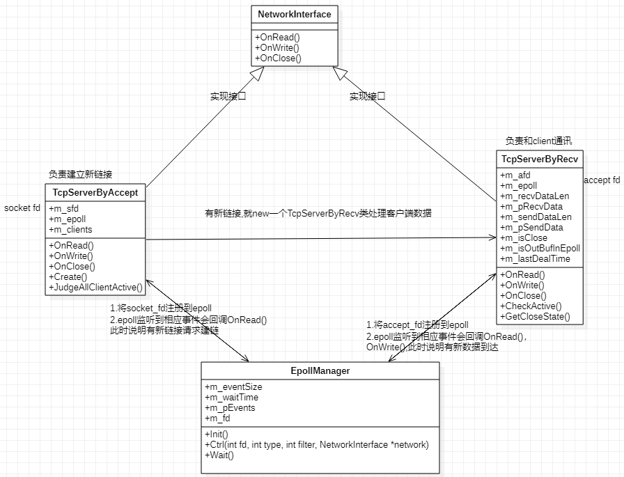
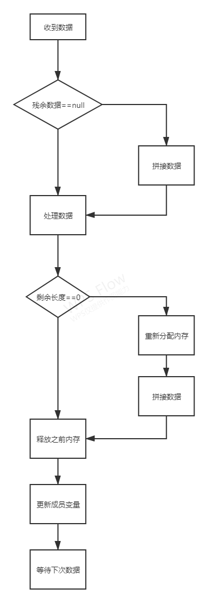
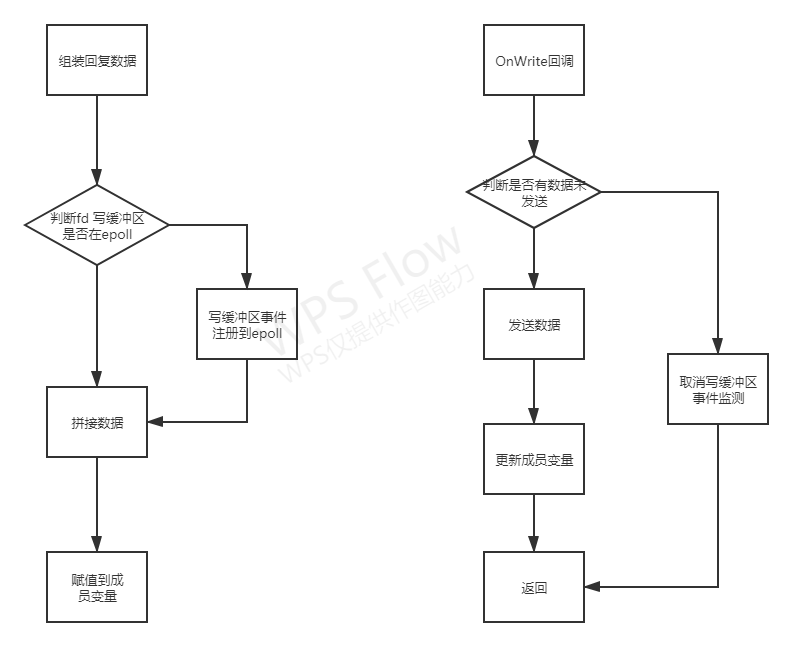
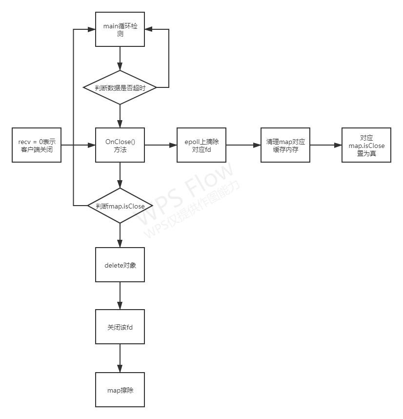

# echo_tcp_server

## 1. 目的

本程序使用epoll实现了一个简单的echo服务端。

## 2. 编译

make udp_svr	编译udp服务端	输出：echo_udp_svr

make tcp_svr	编译tcp服务端	输出：echo_tcp_svr

make tcp_client	编译tcp客户端	输出：echo_tcp_client

make clear	清除上面三个程序

## 3. 使用

udp服务端：./echo_udp_svr -p [PORT]

tcp服务端：./echo_tcp_svr -p [PORT]

tcp客户端：./echo_tcp_client -a [IP] -p [PORT]

## 4. 架构

### 4.1 epoll逻辑

程序用epoll实现，死循环执行epoll_wait(), 然后创建socket之后将socketfd注册到epoll上，一旦检测到socketfd的读缓冲区有变化则说明有新链接请求建链，这时调用accept，得到acceptfd，在new一个tcpServerByRecv类负责处理该客户端发来的数据，同时将acceptfd注册到epoll树上。

### 4.2 粘包处理

首先判断之前有无残留数据，有就拼接数据在处理，没有直接处理。处理完毕之后在判断有没有剩余数据，有就继续保留，无就释放之前内存。

### 4.3 回复数据

回复客户端数据之前先判断fd 写缓冲区事件是否在epoll中(成员变量记录)，不在先将该事件注册到epoll。然后判断上次有无残余未发送数据，有就拼装之后更新成员变量，无直接将需要回复的数据挂载到成员变量(长度和地址)。当epoll监听到写缓冲区可写时会回调OnWrite函数，如果此时发现并无数据可发送，为了避免一直回调OnWrite，这时需要取消监听。如果有数据还未发送(判断成员变量中保存的长度和地址)，那么继续调用send发送数据。

### 4.4 主逻辑

epoll采用边沿非阻塞模式，每次wait的时间是3s，另外主循环中还负责检测客户端数据是否超时，如果超时就把map对应的isClose置为真，同时从epoll树上摘除该fd,并清理该fd对应的缓冲内存。一旦检测到某个客户端的isClose为真，那么就delete对应对象(每收到一个客户端的建链请求，都会new 一个 TcpServerByRecv对象负责和该客户端通讯)，同时从map擦除该clientID,并调用close关闭该clientID.

## 5.协议结构

	客户端请求数据
	| payload length     | => int32_t(网络序)，本次请求中的payload长度
	| expect  length     | => int32_t(网络序)，本次请求期望服务端响应的数据长度
	| magic number: 0x01 | => int32_t(网络序)
	| payload .....      | => 内容不校验，可以全0
	
	服务端响应数据
	| payload length | => int32_t(网络序)，响应的payload长度，应和expect length一致
	| payload .....  | => 内容不校验，可以全0